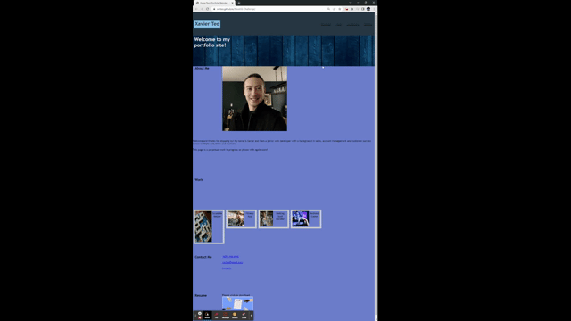

# Week02-Challenge

## Description:

Based on the user story and acceptance criteria, a portfolio website was created. This portfolio website is to provide potential employers information about me and the work that I've done. There are placeholders to the individual work links which I will update as the class moves along.

May 2023 - Updated with some content from my React portfolio found here: http://xvrteo.github.io/React-Portfolio

### Screenshots:

OLD:

May 22, 2023:

### Links:

https://xvrteo.github.io/Week02-Challenge/

https://github.com/XvrTeo/Week02-Challenge
